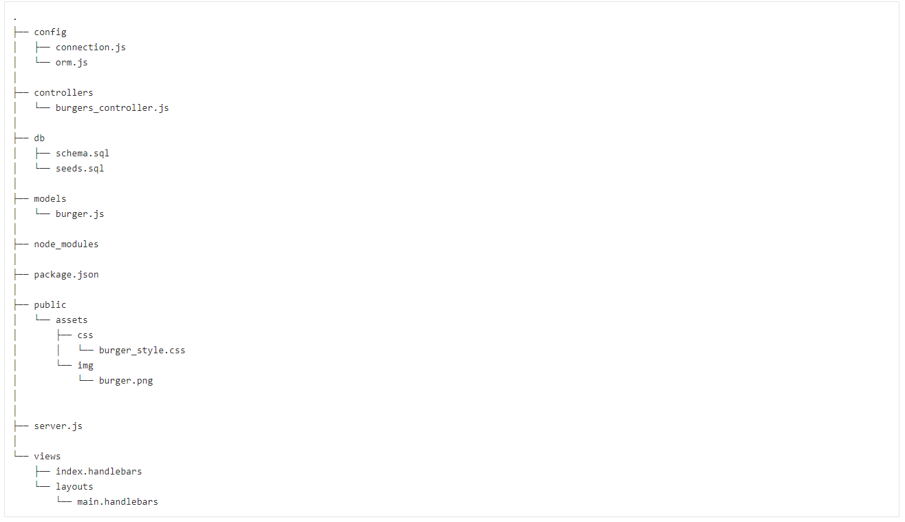
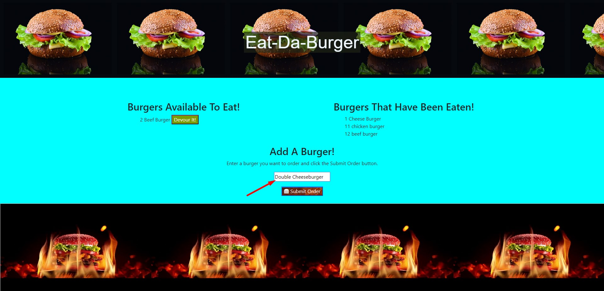
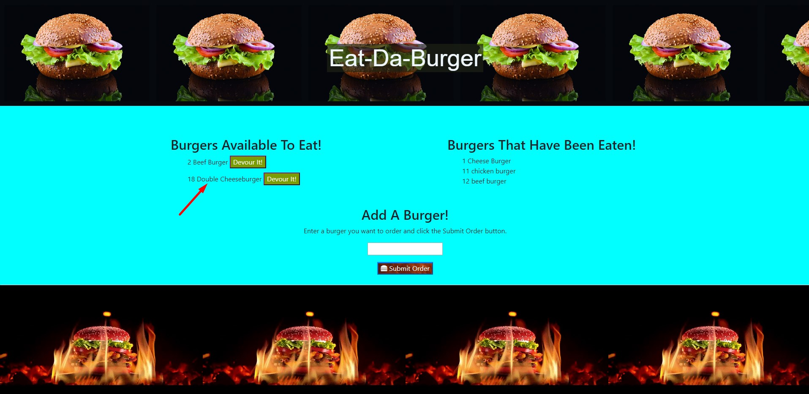
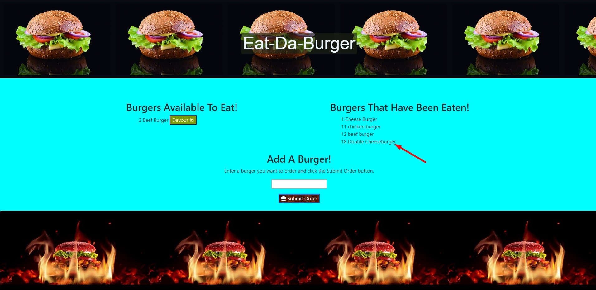
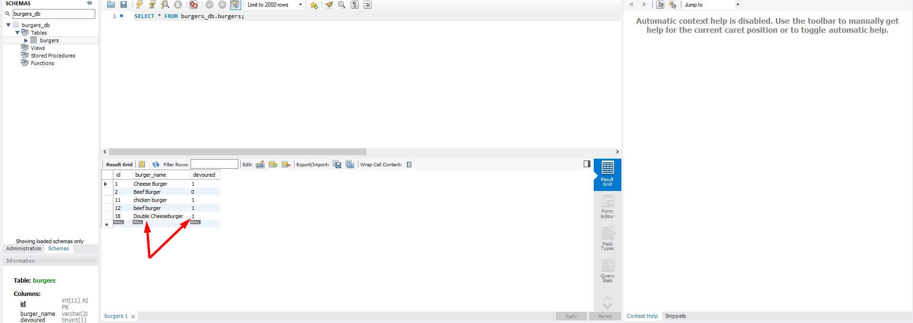

<h1>:hamburger:Eat-Da-Burger</h1>

<h3>	:mag_right:Overview</h3>
In this assignment, create a burger logger with MySQL, Node, Express, Handlebars and a homemade ORM (yum!). use Node and MySQL to query and route data in the app, and Handlebars to generate HTML.

<h3>:bar_chart:Directory Structure (MVC)</h3>
All the recommended files and directories from the steps above should look like the following structure:

<h3></h3>

<h3>:man_cook:Usage of Eat-Da-Burger </h3>

<ul>
<li>Eat-Da-Burger! is a restaurant app that lets users input the names of burgers they'd like to eat.</li>

<li>Whenever a user submits a burger's name, your app will display the burger on the left side of the page, waiting to be devoured.</li>

<li>Each burger in the waiting area also has a Devour it! button. When the user clicks it, the burger will move to the right side of the page.</li>

<li>App will store every burger in a database, whether devoured or not.</li>

</ul>
